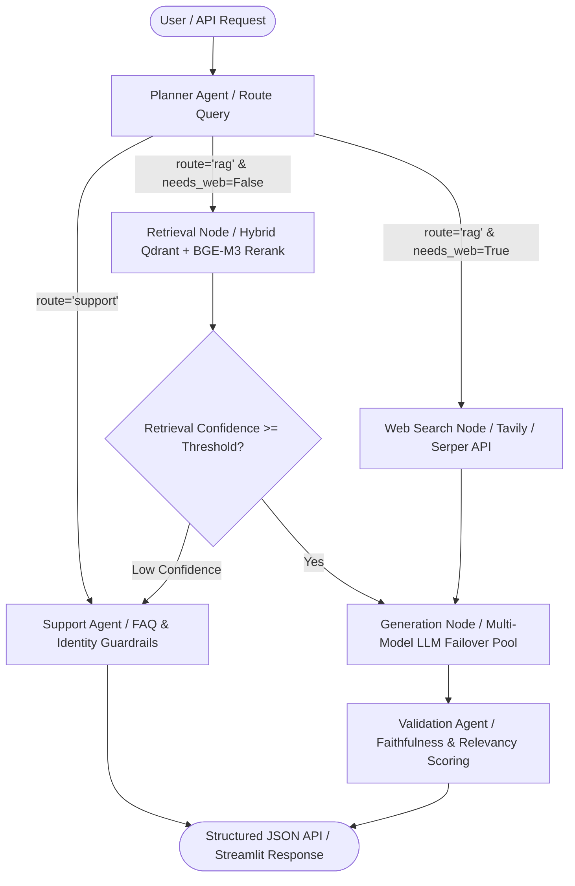
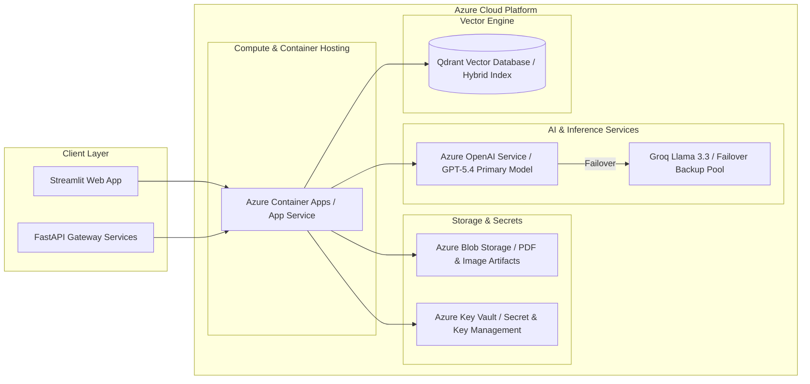

# InSightDocs — Architecture & Design Specifications

## 1. System Overview
**InSightDocs** is an enterprise-grade, stateful **Multi-Agent Multimodal Document Intelligence Platform**. It ingests mixed-content research papers and enterprise documentation (containing text, formulas, tables, charts, and embedded figure diagrams) into a **Qdrant Vector Database** powered by **BGE-M3 Native ColBERT reranking** and **BM25 hybrid sparse search**.

---

## 2. Multi-Agent System Architecture

The core reasoning engine is built using **LangGraph** as a stateful directed graph. A centralized **Planner Agent** classifies incoming user intents, normalizes queries, resolves pronouns/typos, and dynamically routes execution between retrieval nodes, support guardrails, and real-time internet search tools.

### 🤖 Agentic Workflow Diagram

### 🧩 Core Agent Responsibilities

| Agent / Node | Module Path | Primary Responsibility | Key Inputs / Outputs |
|---|---|---|---|
| **Planner Agent** | `app/agents/planner_agent.py` | Analyzes query intent, performs coreference resolution, rewrites typos (*"vanderrer"* ➔ *"VANDERER"*), and outputs routing metadata (`route`, `scope`, `needs_image`, `needs_web_search`, `answer_length`). | Input: Raw query Output: Structured routing JSON |
| **Retrieval Node** | `app/agents/nodes.py` | Queries Qdrant using dense BGE-M3 vectors + BM25 sparse index, applies BGE-M3 Native ColBERT reranking, and extracts visual image chunks. | Input: Rewritten query Output: Top reranked context chunks |
| **Generation Node** | `app/agents/nodes.py` | Synthesizes grounded, technical answers with LaTeX equations using a multi-provider LLM Failover Pool. | Input: Context chunks Output: Final text answer |
| **Validation Agent** | `app/agents/nodes.py` | Evaluates answer faithfulness against retrieved chunks ($0.40\text{faithfulness} + 0.30\text{relevancy} + 0.30\text{recall}$). | Input: Query + Context + Answer Output: Validation score & status |
| **Support Agent** | `app/agents/support_agent.py` | Handles user identity guardrails (`who am i`), assistant introductions, knowledge base document title inventory, and parametric fallbacks. | Input: Support query Output: Guardrailed answer |
| **Web Search Node** | `app/agents/web_search_tool.py` | Queries Tavily / Serper APIs for real-time external web search when technical context requires recent SOTA verification. | Input: Web query Output: Live web search snippets |

---

## 3. Azure Cloud Infrastructure Architecture

InSightDocs is designed for production container hosting on **Microsoft Azure**, using **Azure Container Apps**, **Azure Blob Storage**, **Azure Key Vault**, and **Azure OpenAI**.

### ☁️ Azure Cloud Deployment Diagram

---

## 4. Architecture Decision Records (ADRs)

### ADR 1: LangGraph for Stateful Multi-Agent Orchestration
- **Decision**: Adopt LangGraph state machine over linear chains.
- **Rationale**: Enables conditional branching, dynamic loops, confidence-based edge fallbacks, and fine-grained state inspection across nodes.

### ADR 2: Hybrid Qdrant Vector Search + BGE-M3 Native ColBERT Reranking
- **Decision**: Use Qdrant with dense BGE-M3 embeddings, BM25 sparse vectors, and BGE-M3 ColBERT late-interaction reranking.
- **Rationale**: Reranking elevates exact technical phrase precision, page-level figure lookup, and table metric retrieval.

### ADR 3: Multi-Provider LLM Failover Pool
- **Decision**: Implement a 4-step failover chain (`Azure OpenAI GPT-5.4` ➔ `Azure OpenAI GPT-5.4 Backup` ➔ `OpenAI GPT-4o-mini` ➔ `Groq Llama-3.3-70B`).
- **Rationale**: Guarantees zero-downtime availability and high throughput resilience against quota rate limits (HTTP 429) or regional outages (HTTP 401).
