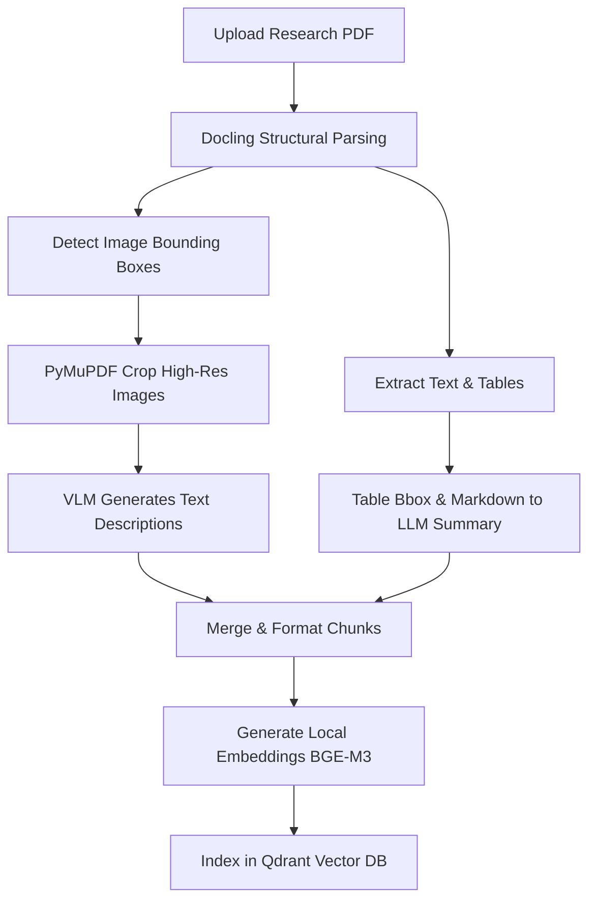
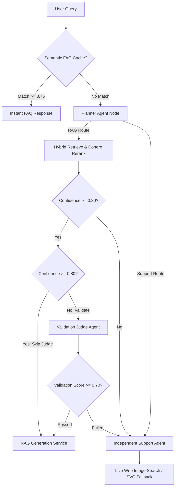

# InSightDocs Architecture & Design Documentation

This document provides a detailed breakdown of the architecture, design choices, ingestion pipeline, retrieval strategy, and multi-agent orchestration flow within **InSightDocs**.

---

## 🏗️ 1. Architectural Philosophy

### LangGraph State-Graph Orchestration Flow
Instead of black-box agent chains, InSightDocs uses **LangGraph (`StateGraph`)** for transparent, stateful multi-agent orchestration. Developers can step through per-turn execution graphs, profile node latencies directly, and maintain state isolation per query turn.

---

## 📥 2. Document Ingestion Pipeline

The ingestion pipeline handles technical scientific papers using structural PDF analysis and multimodal chunking.

### Docling Structural Parsing & PyMuPDF Image Extraction
1. **Structural Analysis**: We run **Docling** to parse the PDF document's layout into elements (paragraphs, tables, images, headings).
2. **PyMuPDF Cropping**: Docling identifies the bounding boxes (`bbox`) of all images on a page. We then use **PyMuPDF (fitz)** to crop and extract these high-resolution images directly from the original PDF file based on the bounding boxes.
3. **Multimodal Description**: These extracted image files are passed to a Vision-Language Model (VLM) to generate highly descriptive text labels of the figures and charts.

### Cost-Optimized Table Summaries
* **The Optimization**: Table rendering and table-image parsing via VLMs are computationally expensive and costly. To save costs, we extract the structural Markdown representation and bounding box metadata directly from Docling and feed it into a text-based LLM.
* **Fallback Chain**: We use a fallback chain of **Groq** $\rightarrow$ **Gemini** $\rightarrow$ **Azure OpenAI** to perform table summarization. This ensures we attempt the most cost-effective provider first before falling back to premium Azure OpenAI models.

### Ingestion Checkpoint Recovery & Retries
* **State Checkpoints**: The ingestion process maintains state. If interrupted, the pipeline will resume from the last successful checkpoint instead of re-processing the entire document. It automatically deletes incomplete or corrupted duplicate chunks before resuming.
* **API Resiliency**: Includes exponential backoff retries for all external LLM/VLM description requests to mitigate rate-limits.

---

## 🔍 3. Vector Database & Hybrid Retrieval Strategy

InSightDocs combines lexical matching, dense semantic matching, and cross-encoder reranking to fetch the highest-quality context.

### Qdrant Vector Database
All document chunks (text, table summaries, and image descriptions) are indexed in a high-performance **Qdrant** collection.

### Hybrid BM25 & Dense Search (RRF)
To ensure we capture both exact keyword matches (e.g., technical equations, model names) and semantic intent:
* **Dense Retrieval**: We use local `BAAI/bge-m3` embeddings, which are highly performant and open-source.
* **Sparse Retrieval**: BM25 keyword matching is computed alongside the dense cosine similarities.
* **Reciprocal Rank Fusion (RRF)**: Merges the ranked outputs of dense and sparse searches into a single unified list.

### Cohere Rerank (`rerank-v3.5`)
* After fetching the top candidates, we pass them to Cohere's Cross-Encoder reranking API.
* Reranking evaluates the query-to-context relevance dynamically, returning a prioritized context chunk list with high-accuracy scores.

---

## 🤖 4. Multi-Agent Orchestration Flow

Every incoming user query triggers a coordinated multi-agent workflow powered by LangGraph:

1. **Semantic FAQ Engine (`faq_node`)**: Checks incoming queries against a cached FAQ store (`data/faq.json`). High-confidence matches ($\ge 0.75$) return instant cached answers.
2. **Planner Agent Node (`planner_node`)**: Performs structured LLM query classification, correcting typos and determining routing (`rag` vs `support`), visual intent (`needs_image`), web search requirement (`needs_web_search`), and answer length.
3. **Retrieval Confidence Check (`retrieval_node`)**: Evaluates average rerank confidence score of top hits. If Confidence $< 0.30$, redirects to Support Agent.
4. **Validation Agent (`validation_node`)**: LLM-as-a-judge scoring candidate answers on Faithfulness, Answer Relevancy, and Context Recall. If score $< 0.70$, redirects to Support Agent.
5. **Independent Support Agent (`support_node`)**: Operates independently by discarding RAG state upon fallback. Uses LLM parametric knowledge and fetches real architecture diagrams via **Live Web Image Search (Tavily API)** with high-contrast SVG diagram fallback.

---

## 💻 5. Streamlit Interactive UI

The UI provides a modern, fast, and informative chat interface.
* **Dynamic Ingestion**: Support for uploading scientific papers directly from the sidebar. Files are processed and indexed in real-time.
* **⚡ Inline Flow Trace Reports**: Appended directly inside the chat response bubble under a collapsible `
` toggle. It provides full transparency for every query:
  * Route selected by the Planner and its reason.
  * Raw vs. reranked retrieval scores of the top chunk.
  * Validation Agent scores (Faithfulness, Relevancy, Recall) and verdict.
  * Routed engine and total execution latency.

---

## 🚀 6. Future Roadmap

1. ✅ **Workflow Decoupling (Completed)**: LangGraph state-graph router for stateful multi-agent execution.
2. ✅ **FAQ Caching (Completed)**: In-memory vector matching against cached Q&A with dynamic promotion.
3. **Enhanced Checkpoint Recovery**: Resuming incomplete PDF ingestion cleanly and deleting corrupted doc chunks.
4. **Internal Automated Evaluation**: Scheduled cron jobs running local RAGAS evaluators on periodic schedules.
