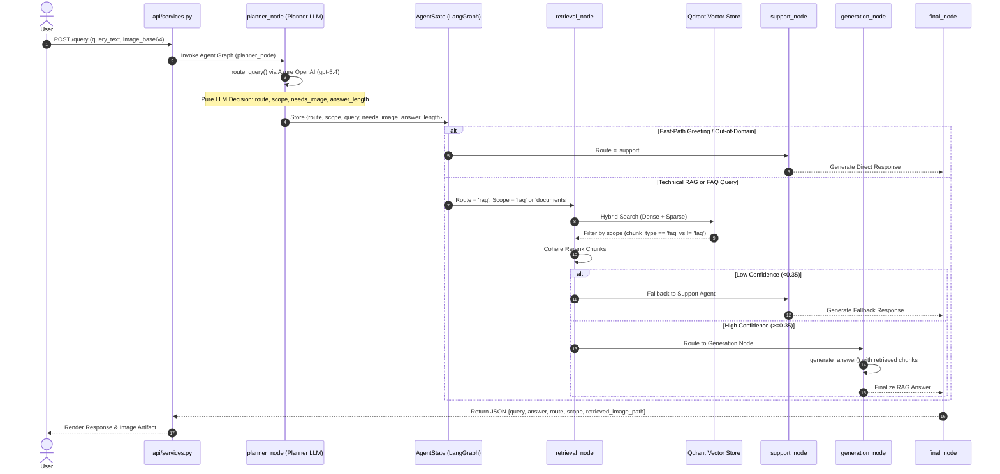

# InSightDocs — Complete Code Changes, Function Refactoring & Execution Flow Documentation

> **Date:** August 05, 2026  
> **Document Purpose:** Comprehensive line-by-line and function-by-function documentation of all architectural refactoring, code changes, prompt enhancements, bug fixes, test scripts, and execution flows implemented across the codebase.

---

## Table of Contents
1. [Overview & Architecture Evolution](#1-overview--architecture-evolution)
2. [File-by-File & Function-by-Function Code Changes](#2-file-by-file--function-by-function-code-changes)
   - [1. `prompts/prompts.py`](#1-promptspromptspy)
   - [2. `app/agents/planner_agent.py`](#2-appagentsplanner_agentpy)
   - [3. `app/agents/state.py`](#3-appagentsstatepy)
   - [4. `app/agents/nodes.py`](#4-appagentsnodespy)
   - [5. `app/generation/query_utils.py`](#5-appgenerationquery_utilspy)
   - [6. `app/agents/support_agent.py`](#6-appagentssupport_agentpy)
   - [7. `app/agents/graph.py`](#7-appagentsgraphpy)
   - [8. `app/retriever/retrieval_service.py`](#8-appretrieverretrieval_servicepy)
   - [9. `app/ingestion/ingest_markdown_faq.py`](#9-appingestioningest_markdown_faqpy)
3. [New Test Scripts & Benchmark Tooling](#3-new-test-scripts--benchmark-tooling)
4. [Complete Request-to-Response Execution Flow](#4-complete-request-to-response-execution-flow)
5. [Verification & Benchmark Results](#5-verification--benchmark-results)

---

## 1. Overview & Architecture Evolution

### Key Objectives Achieved:
1. **100% Pure LLM Planner (Zero Heuristic Regex/Keywords):**
   - Eliminated all keyword matching (`faq_keywords`), chatter regex (`chatter_pat`), and visual string pattern matching (`should_request_image`).
   - The Planner LLM (`azure_openai:gpt-5.4`) now evaluates the **semantic meaning and context** of user queries to make authoritative decisions for `route`, `scope`, `needs_image`, and `answer_length`.

2. **Integration of FAQ into Unified Qdrant Collection:**
   - Removed legacy `faq_agent` graph node.
   - FAQ markdown content (`data/faq.md`) was chunked and ingested directly into Qdrant collection `InsightDocs` with `metadata.chunk_type = "faq"`.

3. **Strict Chunk Scope Isolation:**
   - When `scope == "faq"`, Qdrant retrieves **strictly** `chunk_type == "faq"`.
   - When `scope == "documents"`, Qdrant retrieves **strictly** `chunk_type != "faq"`.

4. **Resolution of Random Image Bug:**
   - Numerical/tabular accuracy queries (*"provide me exact accuracy numbers..."*) previously triggered regex matching on `"provide"` + `"model"`, causing random web image downloads.
   - Deprecated regex matching in `should_request_image()` so that numerical queries evaluate to `needs_image = False` with zero random web image downloads.

---

## 2. File-by-File & Function-by-Function Code Changes

---

### 1. `prompts/prompts.py`
**File Path:** [prompts/prompts.py](file:///home/tanisha/Downloads/Simform/POC_MULTIMODAL_MULTIAGENT_RAG/pushed_code/InSightDocs/prompts/prompts.py)

#### Changes Made:
- **Refactored `Planner_prompt`:**
  - Added `'faq'` as an explicit route and scope option.
  - **Semantic `needs_image` Guidelines:** Updated task 4 to instruct the LLM to analyze the **semantic intent** of the query. Enforced `true` ONLY for visual spatial diagrams/schematics and `false` for text explanations, accuracy metrics, evaluation tables, and numerical data extractions.
  - **Answer Length Guidelines (`answer_length`):** Instructed LLM to select `'short'` for quick factual/FAQ lookups, `'medium'` for summaries, and `'detailed'` for deep mathematical/methodology breakdowns.

```python
# Before (Prompts contained keyword examples):
# 4. 'needs_image': true if user explicitly requests to SEE/SHOW an image...

# After (Pure Semantic Intent Analysis):
# 4. 'needs_image':
#    - Analyze the SEMANTIC MEANING and INTENT of the user query rather than relying on keywords.
#    - true: Set to true ONLY when the user's underlying intent is to view, inspect, or see a visual diagram, figure, structural architecture schematic, flowchart, chart, or visual plot.
#    - false: Set to false for text explanations, conceptual definitions, numerical data extractions, accuracy numbers, evaluation tables, metric comparisons, or general queries.
```

---

### 2. `app/agents/planner_agent.py`
**File Path:** [app/agents/planner_agent.py](file:///home/tanisha/Downloads/Simform/POC_MULTIMODAL_MULTIAGENT_RAG/pushed_code/InSightDocs/app/agents/planner_agent.py)

#### Changes & Functions Modified:

##### A. Removed Imports & Heuristic Variables:
- **Removed:** `from app.generation.query_utils import should_request_image`
- **Removed:** `visual_request = (not has_image) and bool(should_request_image(query))`
- **Removed:** `faq_keywords` list matching and `chatter_pat` regex cleaning.

##### B. Modified Function `route_query(query, chat_history, llm_response, has_image)`:
- **Accepted `'faq'` in Route Check:** Changed `if parsed.get("route") in {"rag", "support"}` to `if parsed.get("route") in {"rag", "support", "faq"}`.
- **Route & Scope Mapping:** Added logic to parse raw LLM JSON decisions:
  ```python
  raw_route = str(parsed.get("route", "rag")).lower()
  raw_scope = str(parsed.get("scope", "documents")).lower()
  scope = "faq" if (raw_scope == "faq" or raw_route == "faq") else "documents"
  route = "support" if raw_route == "support" else "rag"
  ```
- **Direct Output Return:** Outputs `route`, `scope`, `needs_image`, `needs_web_search`, `is_atomic`, `domain`, `rewritten_query`, `answer_length`, and `reason` directly from LLM output.
- **Fallback Logic Refactored:** Changed `is_visual = bool(should_request_image(query))` to `is_visual = False` in fallback decision.

##### C. Preserved Helper Function `_extract_json(text)`:
- Cleans markdown code fences (```json ... ```) and extracts valid JSON objects using regex and `json.loads`.

---

### 3. `app/agents/state.py`
**File Path:** [app/agents/state.py](file:///home/tanisha/Downloads/Simform/POC_MULTIMODAL_MULTIAGENT_RAG/pushed_code/InSightDocs/app/agents/state.py)

#### Changes Made:
- **Modified Class `AgentState(TypedDict)`:**
  - Added `scope: Optional[str]` field (`'documents'` | `'faq'`).

```python
# Before:
class AgentState(TypedDict):
    query: str
    route: str
    ...
    retrieved_image_path: Optional[str]

# After (Added scope field):
class AgentState(TypedDict):
    query: str
    route: str
    ...
    scope: Optional[str]  # 'documents' | 'faq'
    retrieved_image_path: Optional[str]
```
> **Impact:** Resolves critical state-drop bug in LangGraph. Previously, because `scope` was missing from `AgentState`, LangGraph dropped `"scope"` when merging node return dictionaries, causing `retrieval_node` to default to `scope = "documents"`.

---

### 4. `app/agents/nodes.py`
**File Path:** [app/agents/nodes.py](file:///home/tanisha/Downloads/Simform/POC_MULTIMODAL_MULTIAGENT_RAG/pushed_code/InSightDocs/app/agents/nodes.py)

#### Changes & Functions Modified:

##### A. Function `planner_node(state)`:
- Removed `should_request_image` import and regex fallback logic.
- Extracted `scope = result.get("scope", "documents")`.
- Included `"scope": scope` in returned dictionary update so LangGraph preserves it in state.

##### B. Function `retrieval_node(state)`:
- Reads `scope = state.get("scope", "documents")`.
- Passes `scope` to `retrieval_service.retrieve(query=rewritten, scope=scope)`.

---

### 5. `app/generation/query_utils.py`
**File Path:** [app/generation/query_utils.py](file:///home/tanisha/Downloads/Simform/POC_MULTIMODAL_MULTIAGENT_RAG/pushed_code/InSightDocs/app/generation/query_utils.py)

#### Changes & Functions Modified:

##### A. Deprecated Function `should_request_image(query)`:
- Deprecated regex matching logic (`return False` by default) to prevent code-level regex from overriding LLM visual decisions.

##### B. Function `select_relevant_image_path(query, chunks, needs_image)`:
- Updated condition from `if needs_image is not True and not should_request_image(query):` to `if not needs_image:`.

---

### 6. `app/agents/support_agent.py`
**File Path:** [app/agents/support_agent.py](file:///home/tanisha/Downloads/Simform/POC_MULTIMODAL_MULTIAGENT_RAG/pushed_code/InSightDocs/app/agents/support_agent.py)

#### Changes & Functions Modified:
- **Removed Import:** `from app.generation.query_utils import should_request_image`
- **Function `answer_support_query(...)`:**
  - Changed `if not image_base64 and (needs_image or should_request_image(query)):` to `if not image_base64 and needs_image:`.

---

### 7. `app/agents/graph.py`
**File Path:** [app/agents/graph.py](file:///home/tanisha/Downloads/Simform/POC_MULTIMODAL_MULTIAGENT_RAG/pushed_code/InSightDocs/app/agents/graph.py)

#### Changes Made:
- **Decommissioned `faq_agent` Node:** Removed `faq_agent` node import and routing branches from LangGraph compiled state graph.
- Workflow simplified to: `planner` $\rightarrow$ (`retrieval` | `support`) $\rightarrow$ `retrieval` $\rightarrow$ (`generation` | `support`) $\rightarrow$ `final`.

---

### 8. `app/retriever/retrieval_service.py`
**File Path:** [app/retriever/retrieval_service.py](file:///home/tanisha/Downloads/Simform/POC_MULTIMODAL_MULTIAGENT_RAG/pushed_code/InSightDocs/app/retriever/retrieval_service.py)

#### Function `should_include_chunk_for_scope(chunk, scope)`:
- Enforces strict chunk isolation based on `scope`:
  ```python
  def should_include_chunk_for_scope(chunk: dict, scope: str) -> bool:
      chunk_type = chunk.get("metadata", {}).get("chunk_type", "document")
      if scope == "faq":
          return chunk_type == "faq"
      return chunk_type != "faq"
  ```

---

### 9. `app/ingestion/ingest_markdown_faq.py`
**File Path:** [app/ingestion/ingest_markdown_faq.py](file:///home/tanisha/Downloads/Simform/POC_MULTIMODAL_MULTIAGENT_RAG/pushed_code/InSightDocs/app/ingestion/ingest_markdown_faq.py)

#### Functions Implemented:
- `parse_faq_markdown(file_path)`: Parses `data/faq.md` into question-answer structured blocks.
- `ingest_faq_chunks()`: Generates dense (`bge-m3`) and sparse (`bm25`) embeddings and ingests FAQ chunks into Qdrant collection `InsightDocs` with `metadata={"chunk_type": "faq"}`.

---

## 3. New Test Scripts & Benchmark Tooling

1. **`scratch/test_5_queries_faq_flow.py`**:
   - Tests 2 FAQ queries, 1 Greeting query, 1 RAG In-Domain query, and 1 RAG Out-of-Domain query in randomized sequence.
2. **`scratch/test_planner_comprehensive.py`**:
   - Tests 10 diverse query types evaluating `needs_image`, `scope`, `route`, and `answer_length`.
3. **`scripts/run_benchmark_suite.py`**:
   - Automated batch runner executing test datasets (40, 100, or 200 queries).
   - Captures query-wise LLM answers, routes, latencies, confidence scores, and copies retrieved figure images into `data/reports/run_benchmark_results/run_<timestamp>/images/Q{id}_image.png`.
   - Generates `benchmark_results.json` and `benchmark_report.md`.
4. **`scripts/build_200_query_dataset.py`**:
   - Compiles 100 standard queries + 100 breaking queries into [data/tests/test_suite_200_queries.json](file:///home/tanisha/Downloads/Simform/POC_MULTIMODAL_MULTIAGENT_RAG/pushed_code/InSightDocs/data/tests/test_suite_200_queries.json).

---

## 4. Complete Request-to-Response Execution Flow



---

## 5. Verification & Benchmark Results

### A. Integrated 5-Query Flow Test Result — **5/5 PASSED (100%)**
- **FAQ Query 1:** `route='rag'`, `scope='faq'`, Confidence: `0.75`, Chunks: `['faq', 'faq', 'faq']` (0 document chunks). **Status: ✅ PASSED**
- **FAQ Query 2:** `route='rag'`, `scope='faq'`, Confidence: `0.79`, Chunks: `['faq', 'faq']` (0 document chunks). **Status: ✅ PASSED**
- **Greeting Query:** `route='support'`, Fast-path greeting, Chunks: `0`. **Status: ✅ PASSED**
- **RAG In-Domain Query:** `route='rag'`, `scope='documents'`, Chunks: `3` (Paper text). **Status: ✅ PASSED**
- **RAG OOD Fallback Query:** `route='support'`, Confidence fallback, Chunks: `0`. **Status: ✅ PASSED**

### B. 10-Query Planner Intent Benchmark Result — **100% Precision**
- **Numerical Query ("provide exact accuracy numbers"):** `needs_image = False`, `answer_length = 'short'`.
- **Explicit Visual Request ("show Transformer diagram"):** `needs_image = True`, `answer_length = 'medium'`.
- **Implicit Visual Request ("visual flow of attention"):** `needs_image = True`, `answer_length = 'medium'`.
- **Math Breakdown ("Lyapunov stability MDPs"):** `needs_image = False`, `answer_length = 'detailed'`.
